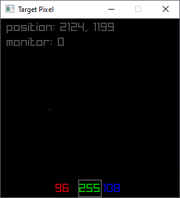

A pixel utility for identifying dead or stuck pixels 

it does this by drawing a single pixel and then displaying the monitor's X and Y positions of the drawn pixel, not the window's. 

Clicking anywhere in the monitor will move the pixel to where you clicked. 
Using the arrow keys, you can move the pixel one pixel at a time. 
The purpose is to place the drawn pixel over the stuck or dead pixel. 

Using the WASD changes the color of the pixel. The current color values are printed at the bottom of the screen. 
A and D lets you choose which color channel to adjust, Red, Green or Blue 
W and S lets you raise or lower the channel's value from minimum (0) to maximum (255) 

X will swap the color of the pixel between your selected color and cycling through random colors. This is a method that can supposedly "unstuck" a stuck pixel 
Z will swap the background color from full black to full white for visibility in trying to find the stuck or dead pixel 

Limitations: 
Moving the window won't update the pixel position printout, but the arrow keys and the mouse click will. 
if the window is placed so that it's displayed on multiple monitors, the pixel position will display relative to the active monitor only. 

<picture>

</picture>

https://odin-lang.org/docs/overview/  
https://www.raylib.com/  
